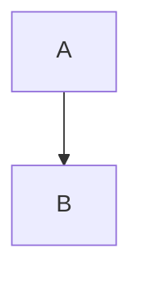

Markdown 是一种轻量级标记语言，通过简单的符号和语法实现快速排版，适用于文档编写、博客、笔记等场景。以下是 **Markdown 核心语法**的详细介绍：

---

### **一、基础语法**

#### 1. 标题

通过 `#` 符号定义标题层级，最多支持六级标题：

```markdown
# 一级标题

## 二级标题

### 三级标题

#### 四级标题

##### 五级标题

###### 六级标题
```

#### 2. 段落与换行

- **段落**：直接输入文字，段落间用空行分隔。
- **换行**：行尾添加两个空格或使用 `<br>`。

#### 3. 文字样式

- **粗体**：`**粗体**` 或 `__粗体__` → **粗体**
- **斜体**：`*斜体*` 或 `_斜体_` → _斜体_
- **删除线**：`~~删除线~~` → ~~删除线~~

#### 4. 列表

- **无序列表**：用 `-`、`+` 或 `*`：
  ```markdown
  - 项目1
  - 项目2
    - 子项目（缩进2空格或1 Tab）
  ```
- **有序列表**：数字 + `.`：
  ```markdown
  1. 第一项
  2. 第二项
     1. 子项
  ```

#### 5. 引用

用 `>` 表示引用，支持嵌套：

```markdown
> 一级引用
>
> > 二级引用
```

#### 6. 代码

- **行内代码**：用反引号包裹 `代码`
- **代码块**：用三个反引号 + 语言标识（可选语法高亮）：
  ````markdown
  ```python
  print("Hello Markdown")
  ```
  ````

---

### **二、高级语法**

#### 1. 链接与图片

- **链接**：`[显示文本](链接地址 "可选标题")` → [示例](https://example.com)
- **图片**：``

#### 2. 表格

用 `|` 分隔列，`-` 分隔表头与内容：

```markdown
| 左对齐 | 居中对齐 | 右对齐 |
| :----- | :------: | -----: |
| 内容1  |  内容2   |  内容3 |
```

效果：
| 左对齐 | 居中对齐 | 右对齐 |
| :----- | :------: | -----: |
| 内容1 | 内容2 | 内容3 |

#### 3. 分隔线

用三个 `-`、`*` 或 `_`：

```markdown
---
```

#### 4. 任务列表

用 `- [ ]` 或 `- [x]` 表示未完成/已完成：

```markdown
- [x] 任务1
- [ ] 任务2
```

效果：

- [x] 任务1
- [ ] 任务2

---

### **三、扩展语法（部分解析器支持）**

#### 1. 脚注

用 `[^标签]` 定义脚注：

```markdown
这是一个脚注[^1]。
[^1]: 脚注内容。
```

#### 2. 数学公式

用 `$$` 包裹 LaTeX 公式：

```markdown
$$
E = mc^2
$$
```

#### 3. 流程图/Mermaid图

部分工具（如 Typora、GitHub）支持 Mermaid：

````markdown

````
