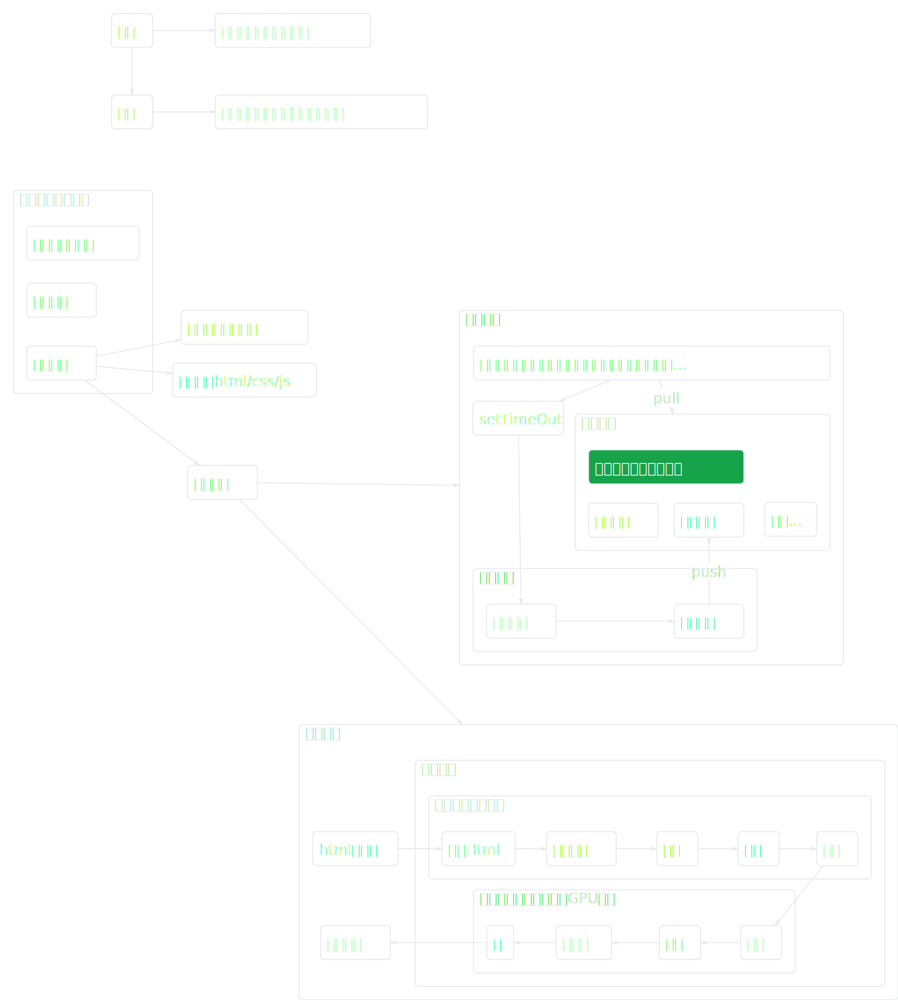

前端开发是一个快速演进且涵盖广泛的领域，主要分为以下几个核心方向及相关技术栈，以下内容以 **结构化分类** 和 **技术深度解析** 呈现：

---

### 一、基础核心技术

#### 1. **HTML/CSS/JavaScript**

- **定位**：前端开发的基石。
- **关键内容**：
  - [HTML5](./2.1.1-html5.md)（语义化标签、Web Components）。
  - [CSS3](./2.1.2-css3.md)（Flexbox/Grid布局、动画、CSS-in-JS）。
  - JavaScript：[基础知识](./2.1.3-javascript-basics)、ES6+、[异步编程](./2.1.5-async-programming)、原型链、模块化）
- **学习重点**：浏览器兼容性、响应式设计、性能优化。

#### 2. **浏览器工作原理**

- **核心机制**：
  - 事件循环和界面渲染。
    <!-- 外部 SVG 文件引用 -->
    
  - JavaScript 引擎（V8 引擎、垃圾回收）。
- **工具**：Chrome DevTools、Lighthouse 性能分析。

---

### 二、框架与工程化

#### 1. **前端框架**

- **主流技术**：
  - React（Hooks、Fiber架构、状态管理如 Redux/Zustand）。
  - Vue（Composition API、Pinia、Vite 生态）。
  - Angular（依赖注入、RxJS、Zone.js）。
- **新兴方向**：微前端（qiankun、Module Federation）、WebAssembly。

#### 2. **工程化与构建工具**

- **工具链**：
  - 打包工具：Webpack（Tree Shaking、Code Splitting）、Rollup、Vite。
  - 包管理：npm/yarn/pnpm。
  - 代码规范：ESLint、Prettier、Husky。
- **核心能力**：自动化构建、依赖管理、性能优化。

---

### 三、渲染策略与架构设计

#### 1. [**渲染模式**](./2.1.3-javascript-basics)

- CSR（客户端渲染）：适用于交互密集型应用（如后台系统）。
- [SSR（服务端渲染）](./2.3.2-ssr-csr-analysis-nuxt)：解决 SEO 和首屏性能（如 Next.js/Nuxt.js）。
- SSG（静态站点生成）：适合内容型网站（如博客、文档站点）。
- 混合渲染（ISR、流式渲染）：Next.js 增量静态再生、React Server Components。

#### 2. **架构设计**

- 单页应用（SPA） vs 多页应用（MPA）。
- 微前端架构：跨团队协作、独立部署。
- 边缘计算（Edge Rendering）：Cloudflare Workers、Vercel Edge Functions。

---

### 四、跨平台与移动端

#### 1. **跨端开发**

- Hybrid App：Cordova、Ionic。
- 跨平台框架：React Native（新架构 Fabric）、Flutter（Skia 引擎）、Taro。
- 小程序生态：微信小程序、Uni-App 多端统一。

#### 2. **桌面应用**

- Electron（VSCode、Slack）。
- Tauri（Rust 轻量级替代方案）。

---

### 五、性能优化与用户体验

#### 1. **性能优化**

- **指标**：LCP、FID、CLS（Web Vitals）。
- **策略**：
  - 资源压缩（Brotli/Gzip、图片懒加载）。
  - 代码分割（Dynamic Import、预加载）。
  - CDN 加速、HTTP/3 协议。

#### 2. **用户体验（UX）**

- 交互动画（GSAP、Framer Motion）。
- PWA（Service Worker、离线缓存）。
- 无障碍（ARIA、屏幕阅读器兼容）。

---

### 六、全栈与新兴领域

#### 1. **全栈开发**

- BFF（Backend for Frontend）：[Node.js](./2.6.1-nodejs-browser-differences) + GraphQL。[nvm](./2.6.2-nvm-nodejs)： Node.js 版本管理工具。
- 服务端技术：Express、NestJS、Serverless（AWS Lambda）。
- 数据库交互：Prisma、TypeORM。

#### 2. **新兴技术方向**

- Web3：智能合约（Solidity）、DApp 开发。
- 低代码/无代码：Retool、Appsmith。
- AI 工程化：TensorFlow.js、与 LLM（如 GPT）的集成。

---

### 七、测试与部署

#### 1. **测试策略**

- 单元测试：Jest、Vitest。
- E2E 测试：Cypress、Playwright。
- 可视化测试：Storybook、Chromatic。

#### 2. **DevOps 与部署**

- CI/CD：GitHub Actions、Jenkins。
- 容器化：Docker、Kubernetes。
- 云服务：Vercel、Netlify、AWS Amplify。

---

### 八、行业细分领域

1. **数据可视化**
   - 图表库：ECharts、D3.js。
   - 大屏应用：WebGL、Three.js。
2. **游戏开发**
   - 引擎：Phaser.js、Babylon.js。
3. **音视频处理**
   - WebRTC、FFmpeg.wasm。

### 九、历史演进

1. [JavaScript的历史演进](./2.9.1-javascript-history)

---

### 学习路径建议

1. **初级阶段**：HTML/CSS → JavaScript → React/Vue。
2. **中级阶段**：工程化工具 → 性能优化 → 全栈技术（Node.js）。
3. **高级阶段**：架构设计 → 跨端开发 → 新兴领域（Web3/AI）。

---

### 技术趋势（2023+）

- **框架演进**：React Server Components、Vue 3 生态深化。
- **渲染创新**：边缘计算、岛架构（Islands Architecture）。
- **工具链革新**：Rust 构建工具（Turbopack）、Bun 替代 Node.js。

前端开发已从简单的页面制作演变为涵盖多端、多场景的复杂系统工程，持续关注 **性能**、**用户体验** 和 **技术整合能力** 是核心竞争力。
